# RiskPremia

A reproducible, intellectually-honest **measurement study** of crypto risk premia.
One apparatus (free, US-reachable, checksum-pinned data; a vendored deflated-Sharpe /
purged-CPCV / bootstrap stack; a cost-model-first kill gate) is pointed at a sequence
of candidate premia:

1. **The perpetual funding carry** (Study 1): does a delta-neutral long-spot /
   short-perp book that collects funding survive realistic retail costs? **Result: an
   honest null.** Net-of-cost Deflated Sharpe is ~0 on every US-tradeable venue and
   horizon; the round-trip cost dwarfs the funding and the post-spot-ETF basis decayed.
   Killed cleanly per the pre-registered criterion ([ADR 0003](docs/decisions/0003-cost-model-and-null.md)).
2. **The variance risk premium** (Study 2): implied variance (Deribit DVOL)
   persistently exceeds subsequently-realized variance in BTC. **Result: a real,
   positive, statistically-significant measurement premium, but the tradeable monthly
   short-straddle gate is non-viable** after costs and crash-tail accounting
   ([ADR 0004](docs/decisions/0004-pivot-to-variance-risk-premium.md)).
3. **The CTREND crypto cross-sectional trend factor** (Study 3): the gross signal has
   real rank-IC quality, but the retail long-only top quintile is non-viable after
   realistic costs, and the academic long-short comparison also fails the conservative
   CPCV-min DSR gate ([ADR 0005](docs/decisions/0005-pivot-to-ctrend-trend-factor.md)).
4. **BTC/ETH slow trend with cash and a volatility cap** (Study 4): the frozen weekly
   spot-only rule is positive and drawdown-reducing, but non-viable because the CPCV
   stress minimum conditional PSR(0) is 0.1439, below the 0.95 gate
   ([ADR 0006](docs/decisions/0006-pivot-to-btc-eth-slow-trend.md)).
5. **CME Micro G6 FX carry** (Study 5 feasibility): killed before implementation because
   the exact free historical CME settlement path is not robust enough for a deployable
   futures backtest and USD 10,000 integer-contract stress can fail account survival
   ([ADR 0007](docs/decisions/0007-kill-cme-micro-g6-fx-carry.md)).
6. **Cross-asset defensive trend** (Study 6): a frozen, no-fit, long-only stock/bond trend
   rule into Treasury bills, on openly-redistributable public-domain data (Kenneth French
   factors and the US Treasury par yield curve), scored in excess of the bill. **The first
   result to clear the deflated full-sample gate: a qualified pass.** Full-sample conditional
   PSR(0) 0.9996 (monthly 0.9970, Deflated Sharpe 0.998 at 32 trials), 11.2% max drawdown,
   2.8% cost share, but regime-dependent (CPCV worst fold 0.72, 2022-onward recency 0.40, with
   the equity sleeve carrying the result and the long-Treasury sleeve the weak part). A classic
   rule validated with full rigor, not a novel edge
   ([ADR 0008](docs/decisions/0008-pivot-to-cross-asset-defensive-trend.md)).
7. **Crypto funding-rate dispersion** (Study 7): a descriptive, explicitly non-deployable
   measurement of the cross-sectional dispersion of perpetual funding across coins (distinct from
   Study 1's level carry), on the clean Binance funding archive. **Result: the dispersion is real
   but decaying and non-capturable at retail.** The equal-weight cross-sectional IQR is 0.106
   annualized (post-spot-ETF 0.091 versus 0.123 before; decay slope -0.013/yr), and the gross
   high-minus-low sort premium of +0.550 annualized requires shorting a wide alt-perp
   cross-section US retail cannot access. A measured object with no tradeable-Sharpe headline
   ([ADR 0009](docs/decisions/0009-pivot-to-funding-dispersion-measurement.md)).
8. **Volatility-managed market portfolio** (Study 8): a retail-deployable swing that adjudicates
   the contested volatility-managed claim (Moreira-Muir 2017 vs Cederburg et al. 2020 and
   Barroso-Detzel 2020) on the project's deflated net-of-cost gate, scored as the managed-minus-
   unmanaged difference over buy-and-hold. **Result: a clean Cederburg replication (an honest
   null).** A real gross volatility-timing alpha of +1.78%/yr at equal volatility does not survive
   the 2.0x retail leverage cap (the dominant drag) and net-of-cost frictions; the difference
   clears nothing (PSR(0) 0.457) and is near-orthogonal to Study 6
   ([ADR 0010](docs/decisions/0010-pivot-to-volatility-managed-equity.md)). The factor-asymmetry
   secondary is a uniform null: the market and all five French factors fail, and the momentum
   standout is a look-ahead.
9. **Industry-trend net-of-market** (Study 9): a retail-deployable swing asking whether price-trend
   timing beats buy-and-hold (not just the bill, the harder test Study 6 skipped), on the clean
   Kenneth French 12-industry daily portfolios, reusing Study 6's frozen no-fit ten-month rule.
   **Result: an honest timing null.** Scored as the strategy minus its own always-invested self
   (pure timing, after a design review stripped an equal-weight-vs-value-weight tilt confound), the
   trend rule clears nothing (PSR(0) 0.229, annualized timing -1.54%/yr): it reduces risk but gives
   up return, and it is timing-redundant with Study 6 (active-bet correlation 0.82)
   ([ADR 0011](docs/decisions/0011-pivot-to-industry-trend-net-of-market.md)).
10. **Long-only quality (profitability) tilt** (Study 10): does holding the high-profitability
    portfolio beat buy-and-hold the market net of cost? On clean daily Kenneth French
    operating-profitability portfolios, scored as the high-profitability-minus-market difference.
    **Result: a real but too-thin premium.** The operating-profitability premium is genuine
    (Fama-French alpha +0.65%/yr, Newey-West t 2.76, robust-minus-weak dominant, beta 0.99), but
    net of the deployable differential expense the difference clears nothing (PSR(0) 0.932, gross
    0.951), the deflation demolishes it (Deflated Sharpe 0.35 at 16 trials), and it decays post-2010.
    The gate prevented a false-pass live deployment
    ([ADR 0012](docs/decisions/0012-pivot-to-quality-tilt.md)).

Sibling to [pit-backtest](https://github.com/sjdoane/pit-backtest), whose headline was a
*reproducible honest momentum null*. The contribution here is the same: cost realism,
confound controls, a pre-registered kill criterion, and reproducibility, never a hyped
backtest. An honest null is a success; a blown-up account or an oversold backtest is a
failure.

> **Status (2026-06-07):** Studies 1, 2 tradeable layer, 3, and 4 are honest nulls, and
> Study 5 was a feasibility kill. Study 2's measurement layer remains a positive finding.
> Study 6, a cross-asset defensive trend on public-domain data, is the first result to clear
> the deflated full-sample gate: a qualified, regime-dependent pass
> ([ADR 0008](docs/decisions/0008-pivot-to-cross-asset-defensive-trend.md)). The same gate
> that rejected five candidates also accepts on the merits. Study 7, a crypto funding-dispersion
> measurement, is done: the dispersion is real but decaying and non-capturable at retail, a
> measured object with no tradeable-Sharpe headline
> ([ADR 0009](docs/decisions/0009-pivot-to-funding-dispersion-measurement.md)). Study 8, a
> volatility-managed market portfolio that adjudicates the contested Moreira-Muir claim on the
> deflated net-of-cost gate, is done: a clean Cederburg replication, the sixth honest null, where
> a real gross timing alpha dies on the retail leverage cap and costs
> ([ADR 0010](docs/decisions/0010-pivot-to-volatility-managed-equity.md)). Study 9, an
> industry-trend net-of-market study asking whether price-trend timing beats the market (not just
> the bill), is done: an honest timing null where the trend rule reduces risk but gives up return,
> the seventh honest result and (with Study 8) evidence that defensive equity timing does not beat
> buy-and-hold at retail
> ([ADR 0011](docs/decisions/0011-pivot-to-industry-trend-net-of-market.md)). Study 10, a long-only
> quality (profitability) tilt, is done: a real but too-thin premium (a genuine, significant
> Fama-French alpha that does not survive the deployable differential cost or the deflation), the
> eighth honest result, where the gate prevented a false-pass live deployment
> ([ADR 0012](docs/decisions/0012-pivot-to-quality-tilt.md)). Live state is
> always in [STATUS.md](STATUS.md).

## Study 6 result: a cross-asset defensive trend (the first qualified pass)

The first candidate to clear the deflated full-sample gate. A frozen, no-fit, monthly,
long-or-cash trend across US equity and long-term US Treasury, parking in Treasury bills when
a sleeve is below its ten-month moving average, on openly-redistributable public-domain data
(the Kenneth French daily factors and the US Treasury par yield curve), 1990 to 2026, scored
in excess of the bill.

| Quantity | Value |
| --- | --- |
| Full-sample conditional PSR(0) | **0.9996** (clears the 0.95 bar) |
| Monthly non-overlapping conditional PSR(0) | **0.9970** (the honest independent unit) |
| Deflated Sharpe at 8 / 16 / 32 inherited trials | **0.999 / 0.999 / 0.998** |
| Max drawdown / cost share / CAGR | **11.2% / 2.8% / 7.1%** |
| CPCV worst fold / 2022-onward recency | **0.72 / 0.40** (the regime stress) |
| Equity sleeve alone / long-Treasury alone | **0.998 / 0.846** |

This is an honest **qualified** pass, not a clean one. The strategy is a classic cross-asset
trend rule, so the contribution is the reproducible, deflated, net-of-cost validation on clean
data, not a novel edge. It passes the full-sample and monthly gates and survives
multiple-testing deflation, with a low drawdown and negligible costs, but it is
regime-dependent: the worst CPCV fold and the 2022-onward slice are below the bar. The
per-sleeve attribution locates the risk: the equity trend sleeve carries the result (and
survives 2022-onward), while the long-Treasury sleeve is weaker on its own and drives the
recent weakness (the rate-driven bond drawdown).

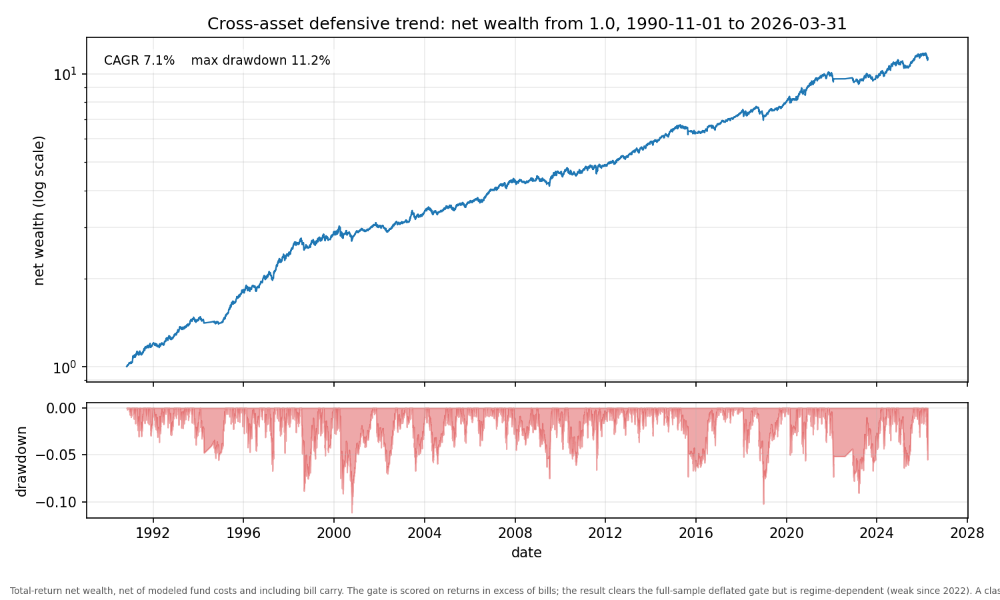

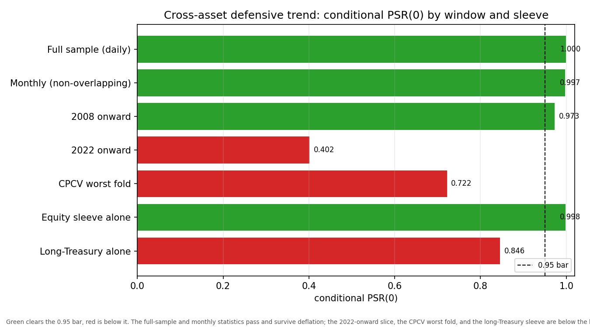

The numbers and figures regenerate from a committed JSON artifact
([artifacts/xtrend_gate.json](artifacts/xtrend_gate.json)) with no data bundle:

```powershell
# render the figures from the committed artifact (needs the figures extra)
python -m scripts.regenerate_xtrend_figures
# rebuild the gate artifact from the committed panel (no network)
python -m scripts.run_xtrend_gate
# rebuild the committed panel from the live public-domain sources (one-time)
python -m scripts.build_xtrend_inputs
```

## Study 7 result: crypto funding-rate dispersion (a measured object, not an edge)

A descriptive measurement, like a volatility surface, not a tradeable verdict. The
cross-sectional dispersion of perpetual funding across the point-in-time top-15 most-liquid
coins, each event annualized by its own funding interval and sampled onto a common daily grid,
2022-01 to 2026-05 (1611 daily observations). The headline is the robust equal-weight
interquartile range; the gross sort premium is the same object in carry units and is reported
only to show it is non-capturable.

| Quantity | Value |
| --- | --- |
| Equal-weight cross-sectional IQR (full sample) | **0.106** annualized (95% CI [0.092, 0.122]) |
| Pre-spot-ETF mean to post-spot-ETF mean | **0.123 to 0.091** (difference -0.032, CI [-0.058, -0.008]) |
| Decay slope | **-0.013/yr** (95% CI [-0.022, -0.004]) |
| Gross high-minus-low sort premium (secondary, non-capturable) | **+0.550** annualized (95% CI [+0.354, +0.783]) |
| Coverage (funded / eligible, worst day) | **91%** (13.6 / 15, worst 73%) |

The dispersion is real and large but **decaying** (the regime difference and the slope both have
confidence intervals that exclude zero on the negative side) and **non-deployable**: capturing
the spread requires shorting a wide altcoin-perp cross-section that US retail cannot access, on a
venue (Binance) that is not US-tradeable. No tradeable Sharpe is quoted anywhere, by design. The
significance is the vendored stationary-block bootstrap on the full daily series, with a
block-deflated effective sample size; a level is positive by construction, so the tested
statements are the signed regime difference and the decay slope, never a vacuous clears-zero
test. Detail and the post-implementation review are in
[docs/research/0010](docs/research/0010-funding-dispersion-measurement-result.md).

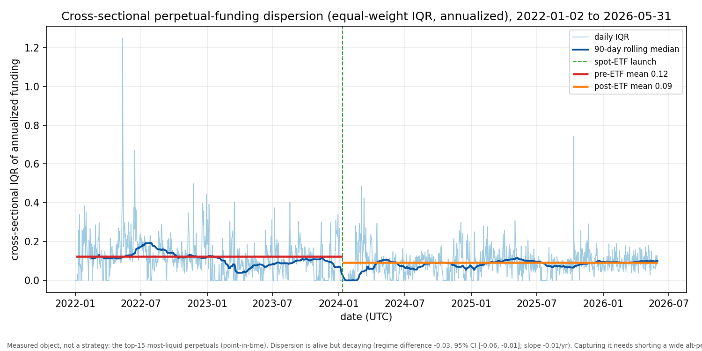

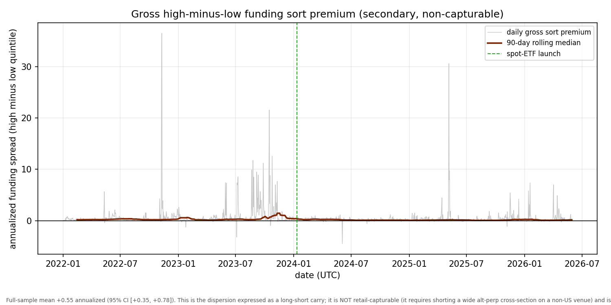

The numbers and figures regenerate from a committed series and JSON artifact, no data bundle
needed for the no-network steps:

```powershell
# render the figures from the committed series + artifact (needs the figures extra)
python -m scripts.regenerate_dispersion_figures
# rebuild the artifact from the committed series (no network)
python -m scripts.run_dispersion_measurement
# rebuild the committed series from the live Binance Vision funding archive (one-time)
python -m scripts.build_dispersion_inputs
```

## Study 8 result: a volatility-managed market portfolio (a clean Cederburg replication)

A retail-deployable swing that adjudicates the contested volatility-managed claim on the project's
deflated net-of-cost gate. The US equity market is scaled inversely to the previous month's
realized variance (Moreira-Muir), and the kill is the managed-MINUS-unmanaged difference over
buy-and-hold (a c-normalized managed market is a levered long-equity position whose standalone
Sharpe is just the equity premium, so only the difference tests volatility timing). 1990 to 2026,
on the same Kenneth French data as Study 6.

| Quantity | Value |
| --- | --- |
| Managed-minus-unmanaged difference PSR(0) (the kill) | **0.457** (bar 0.95) |
| Gross timing alpha (uncapped, costless, equal vol) | **+1.78%/yr** |
| Leverage-cap drag / cost drag / net | **-2.14% / -0.53% / -0.88%** per year |
| Expanding-window real-time c difference PSR(0) | **0.429** (agrees) |
| Difference correlation with Study 6 | **0.042** (near-orthogonal) |

This is a clean **Cederburg replication** and an honest null: a real volatility-timing alpha exists
gross (+1.78%/yr at equal volatility), but it dies on the realistic retail implementation. The
dominant killer is the 2.0x leverage cap (it clips exactly the high-weight calm months the strategy
relies on), not cost, and that attribution is disclosed in the artifact so the null is visibly not
a cost trick. Even the market sleeve, the one documented cost-survivor in Barroso-Detzel, is a null
under this conservative cap-plus-cost stack. The difference is near-orthogonal to Study 6, so the
two are genuinely distinct signals; the managed market simply adds no deployable value.

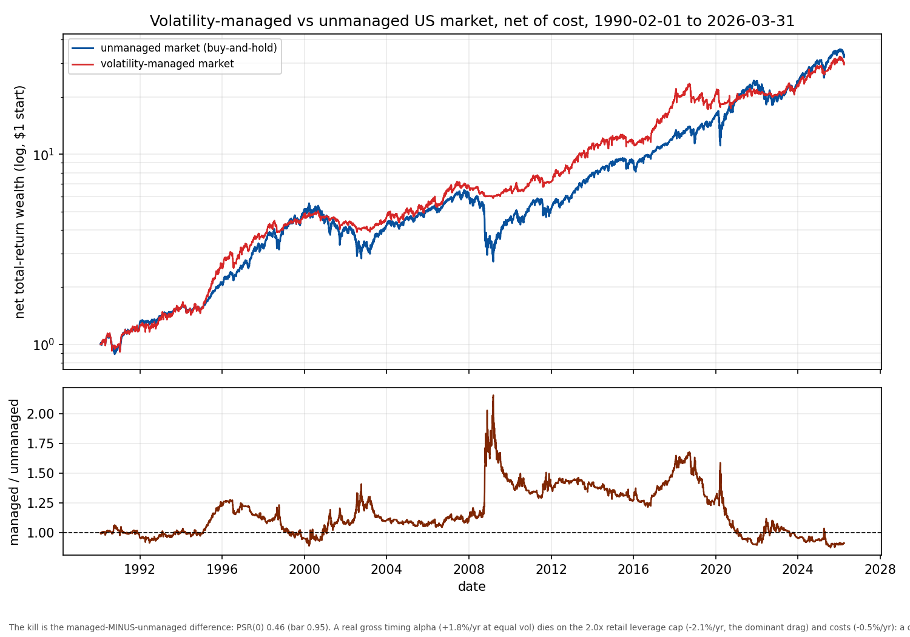

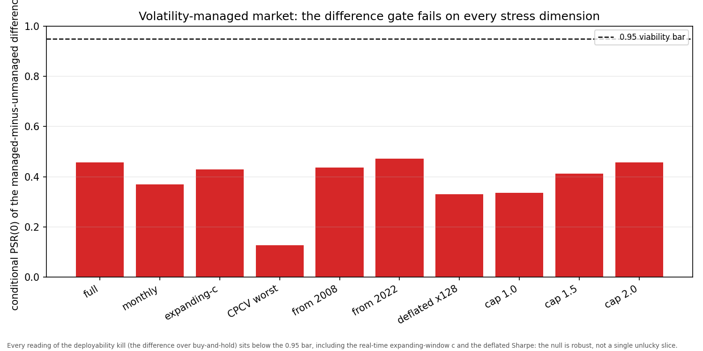

**The factor-asymmetry secondary: a uniform null.** The same scaler applied to the long-short
Kenneth French factors (SMB, HML, RMW, CMA, momentum) with a turnover-only cost gives the same
verdict: the managed market and all five managed factors fail the net-of-cost gate, so the
literature's market-survives, factors-die asymmetry does not hold here. Momentum (WML) is the
apparent standout, with a large +11.57%/yr gross volatility-timing alpha (the Barroso-Santa-Clara
managed-momentum effect), but it is a look-ahead artifact: under the project's own expanding-window
real-time c, its out-of-sample PSR collapses from 0.83 to 0.49 and its net alpha to about zero. The
uniform null is robust out-of-sample.

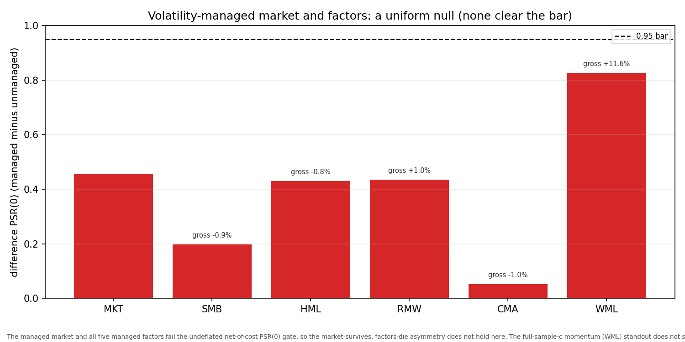

The numbers and figures regenerate from the committed panels with no new data:

```powershell
# render the figures from the committed panels + artifacts (needs the figures extra)
python -m scripts.regenerate_volmanaged_figures
# rebuild the gate and asymmetry artifacts from the committed panels (no network)
python -m scripts.run_volmanaged_gate
python -m scripts.run_volmanaged_factor_asymmetry
```

## Study 9 result: industry trend net-of-market (an honest timing null)

Does price-trend timing beat buy-and-hold, not just the bill? Each of the 12 Kenneth French
industries is held long when it is above its ten-month moving average (Study 6's frozen rule), else
in the bill. A design review caught that the strategy fully invested is an equal-weight industry
book, not the value-weight market, so the honest kill is the strategy minus its own always-invested
self (pure timing), with net-of-market kept as deployable context. 1927 to 2026.

| Quantity | Value |
| --- | --- |
| Pure-timing kill (strategy minus always-invested) PSR(0) | **0.229** (bar 0.95) |
| Timing annualized return / Sharpe | **-1.54%/yr / -0.14** |
| Decomposition: timing + tilt = deploy (per year) | **-1.54% + 0.49% = -1.05%** |
| Context: strategy net-of-bill PSR(0) | **0.9998** (the equity premium, not the kill) |
| Standalone Sharpe: strategy / always-invested / market | 0.62 / 0.49 / 0.45 |
| Active-bet correlation with Study 6 | **0.82** (timing-redundant) |

An honest **timing null**. The strategy's net-of-bill PSR is a near-perfect 0.9998, but that is the
equity premium harvested by a book that is 92% in the market (the same trap Study 8 exposed); only
the strategy-minus-its-own-always-invested-self isolates the timing, and it is negative
(-1.54%/yr). The trend rule lowers volatility (its standalone Sharpe beats always-invested) but
gives up return, so it does not make money over always-invested net of cost: it is crash insurance,
not a market-beater. The decomposition is exposed and exact, and the active-bet correlation of 0.82
shows the strategy makes nearly the same on/off bets as Study 6. With Study 8, this establishes that
defensive equity timing, however the timer is built, does not beat buy-and-hold at retail.

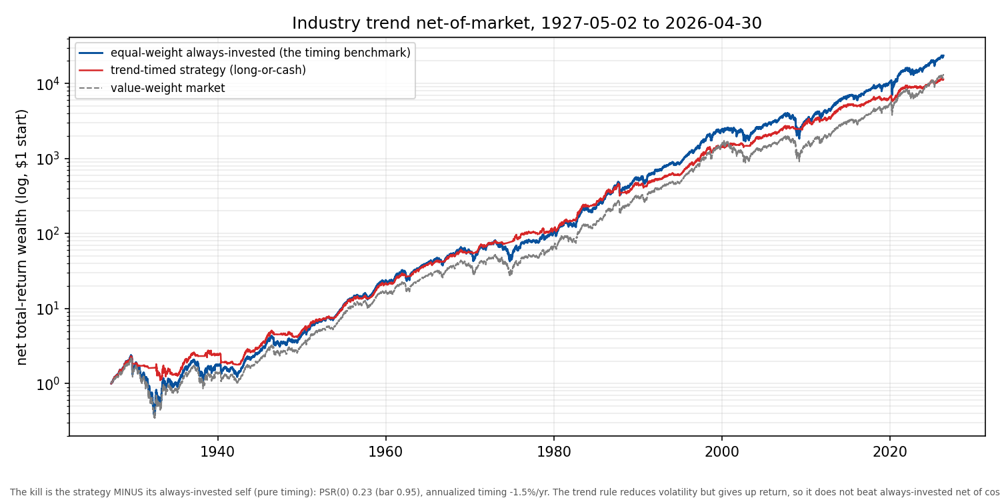

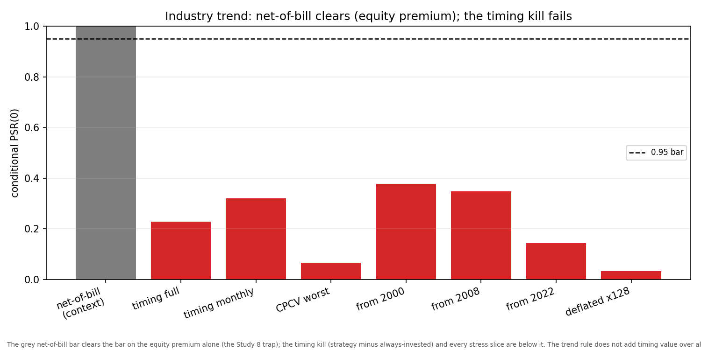

```powershell
# render the figures, then rebuild the gate artifact from the committed panel (no network)
python -m scripts.regenerate_indtrend_figures
python -m scripts.run_indtrend_gate
```

## Study 10 result: a quality (profitability) tilt (a real but too-thin premium)

Does holding the high-profitability portfolio beat buy-and-hold the market net of cost? The Kenneth
French high-operating-profitability value-weighted tercile, held statically, scored as the
difference over the value-weight market, both deployed as ETFs so the honest cost is the differential
expense. A Fama-French regression attributes the difference. 1963 to 2026.

| Quantity | Value |
| --- | --- |
| Difference PSR(0), net of differential cost (the kill) | **0.932** (bar 0.95) |
| Gross (no-cost) difference PSR(0) | **0.951** (before the deployable expense) |
| Fama-French five-factor alpha (Newey-West t) | **+0.65%/yr (t 2.76)** |
| FF5 loadings: market / RMW | 0.99 / **0.31** (quality, not beta or size) |
| Deflated Sharpe at 16 / 128 trials | **0.35 / 0.11** |
| Recency 2000 / 2010 / 2022 | 0.815 / 0.814 / 0.618 |

A **real but too-thin** premium. The operating-profitability premium is genuine and statistically
significant (a +0.65%/yr Fama-French alpha with a Newey-West t of 2.76, robust-minus-weak the
dominant loading, market beta 0.99, so it is quality and not a disguised beta or size tilt). But net
of the deployable differential expense (a quality ETF costs more to hold than a market ETF) the
difference clears nothing (PSR(0) 0.932); the multiple-testing deflation for the heavily-mined
quality factor collapses it to 0.35 at 16 trials (and the widest tercile is the strongest cut, a
broad large-cap-quality signature); and it decays in the post-2010 quality-ETF era. The gross number
(0.951) is a near-miss that the honest deployable cost and the deflation turn into a clear fail. The
operator intended to deploy this live if it passed; the gate showed it is a real academic premium,
not a retail make-money edge, before any capital was committed.

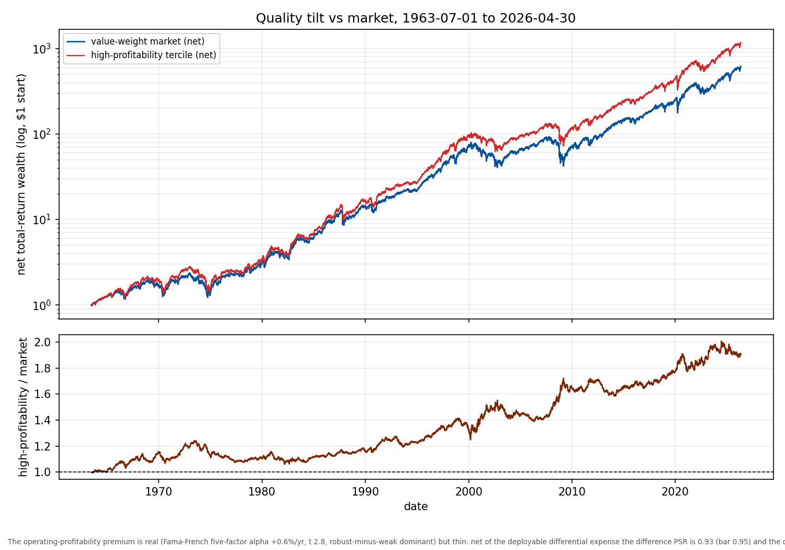

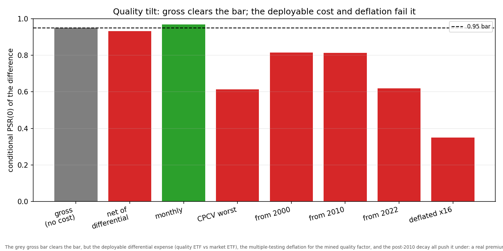

```powershell
# render the figures, then rebuild the gate artifact from the committed panel (no network)
python -m scripts.regenerate_quality_figures
python -m scripts.run_quality_gate
```

## Study 2 result: the BTC variance risk premium

Layer ii is complete and non-viable: the systematic monthly short straddle netted a
Deflated Sharpe of 0.30, below the 0.95 bar, with a slightly negative mean and crash
shocks a retail account could not survive. The measurement layer below remains the
positive result.

Implied variance (the Deribit DVOL index, squared) minus the matched-horizon realized
variance (the variance-swap convention, on the Binance Vision spot closes), BTC,
2022-01 to 2025-05, 30-day horizon:

| Quantity | Value |
| --- | --- |
| Mean VRP (median across non-overlapping phases) | **0.087** annualized variance points |
| 95% CI (phase-0 strided block-bootstrap, overlap-honest) | **[0.033, 0.119]**, clears zero |
| Days with implied > realized | **70%** |
| Pre-spot-ETF mean to post-spot-ETF mean | **0.101 to 0.059** (a decay paralleling the carry) |

The premium is real and positive: implied variance is, on average, dearer than what is
subsequently realized, which is what an option seller is paid for bearing variance and
jump risk. The CI clearing zero is reported on the **non-overlapping** strided series
with a Politis-White block-deflated effective sample size, not a dishonest t-stat on the
29/30-overlapping daily series. This is a **measurement**, not a tradeable result (see
the caveats below and Layer ii).

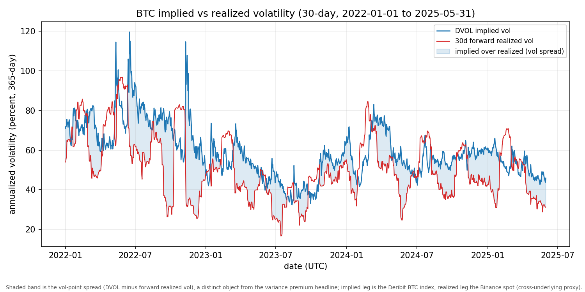

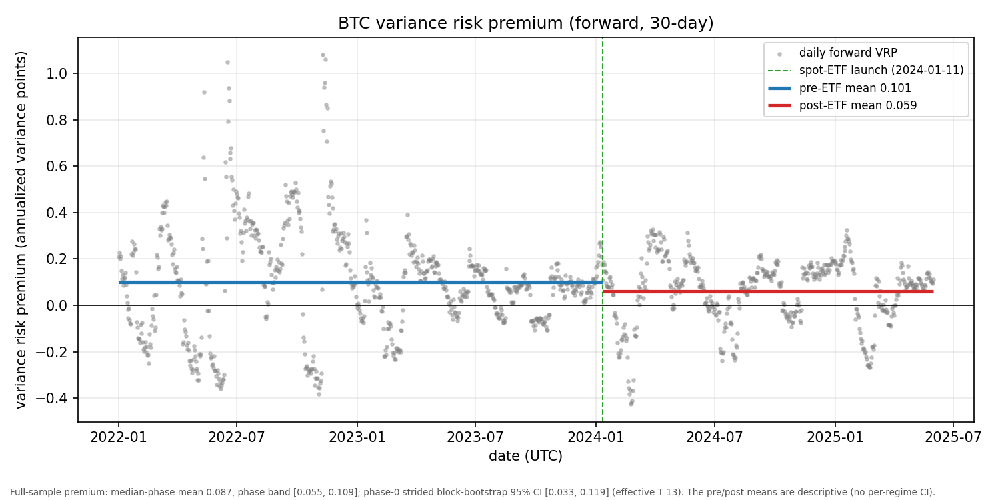

The numbers and figures regenerate from a committed JSON artifact
([artifacts/vrp_measurement.json](artifacts/vrp_measurement.json)) with no data bundle:

```powershell
# render the figures from the committed artifact (needs the figures extra)
python -m scripts.regenerate_figures
# rebuild the artifact + fixtures + manifest stamp from the live data (one-time)
python -m scripts.build_vrp_artifact
```

**Binding caveats (carried in the artifact and on the figures):** the headline is the
measurement plus the regime decomposition, **never a short-volatility Sharpe** (the
Deflated Sharpe cannot price an out-of-sample crash); the point estimate is the
median-phase mean while the CI is the phase-0 strided interval; the implied leg is the
Deribit BTC index and the realized leg the Binance spot, so the premium is a
cross-underlying proxy; and the vol-point spread (figure 1) is a distinct object from the
variance premium (figure 2). The decision to harvest it rests on the in-sample crash
losses plus a peso-adjustment (Layer ii), not on a Sharpe.

## Pre-registered kill criteria (declared before any signal exists)

Each study ships whatever the result is, an honest null included. The criterion gates
**real-money deployment**, not whether the write-up is worth doing.

- **Study 1 (carry,** [ADR 0001](docs/decisions/0001-lead-track-selection.md)**):**
  net-of-all-cost Deflated Sharpe below 0.95 out-of-sample on the held-out post-spot-ETF
  period means declare non-viable. **Triggered: killed.**
- **Study 2 (VRP,** [ADR 0004](docs/decisions/0004-pivot-to-variance-risk-premium.md)**):**
  net-of-all-modeled-cost Deflated Sharpe below 0.95 out-of-sample, **or** an in-sample
  crash loss plus peso-adjustment a retail account could not survive, means declare
  non-viable. The measurement floor (Layer i, above) is the primary deliverable either
  way.
- **Study 3 (CTREND,** [ADR 0005](docs/decisions/0005-pivot-to-ctrend-trend-factor.md)**):**
  net-of-cost CPCV-min DSR below 0.95 on the 2022+ liquid-universe window means the
  published cost-survival claim does not hold under the project's realistic retail-cost
  stress. **Triggered: killed.**
- **Study 4 (BTC/ETH slow trend,** [ADR 0006](docs/decisions/0006-pivot-to-btc-eth-slow-trend.md)**):**
  kill if 2022+ net-of-cost CPCV stress minimum conditional PSR(0) is below 0.95,
  max drawdown exceeds 35%, turnover costs consume more than 25% of gross edge, or the
  result only passes by relaxing the 100% notional cap. **Triggered: killed.**
- **Study 5 (CME Micro G6 FX carry feasibility,** [ADR 0007](docs/decisions/0007-kill-cme-micro-g6-fx-carry.md)**):**
  kill before implementation if the exact free futures-settlement data path fails or
  minimum practical micro sizing can plausibly lose more than 50% of a USD 10,000 account.
  **Triggered: killed.**

## Methodology (the shared discipline)

| Pillar | How |
| --- | --- |
| Cost model first | Build the per-leg modeled cost (fees + spread on entry and exit + funding or option premium) and run a random-entry NULL through it BEFORE any signal. If the signal is not clearly better than the null after costs, there is no edge. |
| Point-in-time discipline | The clock is the market event (the funding settlement; the daily DVOL/realized window), not the calendar. Forward windows use only future data by construction and are never used as a tradeable signal. |
| Honest overlap inference | Overlapping windows are autocorrelated, so the headline is the NON-overlapping strided series with a stationary block bootstrap and a Politis-White block-deflated effective sample size, never a naive t-stat. |
| Deflated performance | PSR / Deflated Sharpe / MinTRL (Bailey and Lopez de Prado 2014) with an honest trial count, reported necessary-not-sufficient for a premium (it cannot price the out-of-sample crash, the peso problem). |
| Confound controls | Premia measured on long Binance history but the US-realized confounds (the venue-basis funding delta; the Deribit-vs-Binance underlying basis) reported as caveats at the point of computation; a pre-committed survivor universe. |
| Reproducibility | Free, keyless, US-reachable, stdlib-only fetch; raw bytes SHA256-stamped into a committed manifest; live/as-of inputs (DVOL) committed as tamper-evident CSV fixtures; only derived aggregate artifacts tracked, so a reviewer regenerates every number from a clone. |

## Reproducibility

Free, no API key, verifiable from a clone. Funding + spot history come from Binance
Vision S3 dumps (checksummed monthly files from 2020); the implied-vol index is the
Deribit DVOL endpoint (keyless, US-reachable). Immutable dumps are gitignored and
re-fetched against a committed SHA256 manifest; the **live/as-of DVOL series** (no
published checksum) is pinned differently: the exact daily closes used are committed as
small CSV fixtures whose SHA256 makes them tamper-evident, so the headline reproduces
**offline** in CI (see `tests/unit/test_vrp_artifact_reproduces_headline.py`). The whole
data layer fetches with the standard library only (zero third-party fetch surface).
(Honest venue note: the live Binance and Bybit REST APIs are geo-blocked from US IPs, a
risk-register entry; the data dumps, OKX, and Deribit DVOL are not.)

## How it is built (process)

Every meaningful component goes through a design plan, an independent senior-quant design
review, implementation, and a post-implementation review; every fork (a track choice, a
go-live decision) goes through a four-lens review plus an adversarial cross-check.
Critical and High findings are addressed before anything is marked done, and the finding
plus its resolution is recorded in the [CHANGELOG](CHANGELOG.md). The analytics and
validation stack (PSR/DSR/MinTRL, purged CPCV, stationary block bootstrap, trial
registry) is vendored with attribution from the sibling project so the repo regenerates
every number on its own. Dependencies are pinned to exact patch; mypy runs strict.

## Reading map

- [STATUS.md](STATUS.md) is the current state and what is deferred (read first).
- [docs/decisions/](docs/decisions/) is the ADR log: [0001](docs/decisions/0001-lead-track-selection.md)
  (lead-track choice + kill criterion), [0002](docs/decisions/0002-data-layer-funding-clock.md)
  (data layer), [0003](docs/decisions/0003-cost-model-and-null.md) (cost model + the carry
  kill), [0004](docs/decisions/0004-pivot-to-variance-risk-premium.md) (the VRP pivot),
  [0005](docs/decisions/0005-pivot-to-ctrend-trend-factor.md) (CTREND), and
  [0006](docs/decisions/0006-pivot-to-btc-eth-slow-trend.md) (BTC/ETH slow trend),
  [0007](docs/decisions/0007-kill-cme-micro-g6-fx-carry.md) (CME Micro G6 FX feasibility),
  [0008](docs/decisions/0008-pivot-to-cross-asset-defensive-trend.md) (cross-asset defensive trend), and
  [0009](docs/decisions/0009-pivot-to-funding-dispersion-measurement.md) (funding-dispersion measurement).
- [CHANGELOG.md](CHANGELOG.md) is the audit trail: every review finding and its resolution.

## Setup

```powershell
# Dedicated venv (kept outside the synced tree)
uv venv --python 3.12 C:\Users\SamJD\.venvs\riskpremia
uv pip install --python C:\Users\SamJD\.venvs\riskpremia\Scripts\python.exe -e ".[dev,figures]"
C:\Users\SamJD\.venvs\riskpremia\Scripts\python.exe -m pytest -q -m "not network"
```

## License

MIT (see [LICENSE](LICENSE)).
